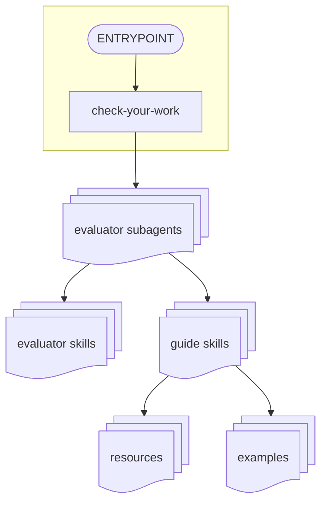
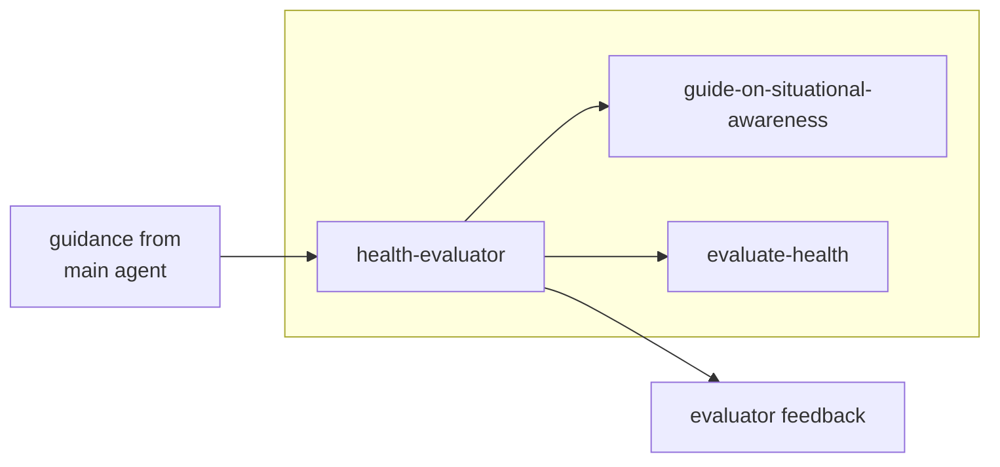
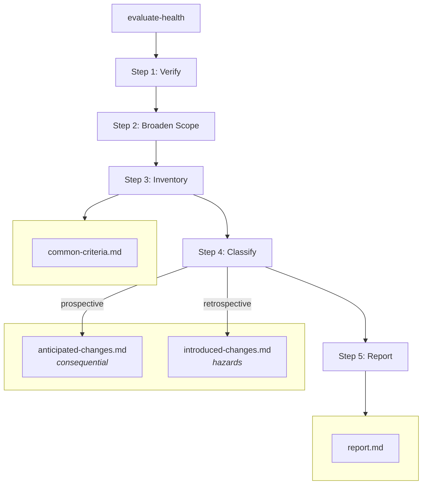

# 🤿 Deep Dive

An agent implementing a change is poorly positioned to evaluate its own work — it tends to rationalize away feedback that conflicts with decisions it has already made. Front-loading all evaluation criteria into the agent's context is also wasteful: most of it is irrelevant to any given task and competes for attention with the task itself.

This plugin addresses both problems. Evaluator subagents, inspired by Anthropic's [harness design case study](https://www.anthropic.com/engineering/harness-design-long-running-apps), isolate evaluation from implementation — trading token efficiency of up-front guidance for improved task focus overall. Progressive skill disclosure, following best practices from Anthropic's [skill-building guide](https://resources.anthropic.com/hubfs/The-Complete-Guide-to-Building-Skill-for-Claude.pdf), keeps the main agent's context lean and surfaces evaluation criteria only when needed.

## 📚 Information Architecture

This plugin is written with a strict information architecture to ensure that the system under evaluation is isolated from implementation knowledge. It uses Claude Code's subagent and skill gating features to enforce this.

Subagents are given a specific set of directions through skill injection, which inserts the evaluator's skills directly into its system prompt. Guidance from the main agent is fed in as a user prompt. Since interactivity isn't possible and the main agent cannot read the evaluator skills, the evaluation criteria should reliably override agent input.

The subagent returns its data to the main agent. Feedback directly relevant to the agent task is typically accepted, after which the agent returns control to its operator.

### 🔄 The FIXME feedback loop

The main agent tends to act on findings that align with its current task and discard the rest. FIXME instructions in the check-your-work skill capture deferred feedback so it isn't lost.

The health-evaluator subagent looks for `FIXME` comments as a strong signal for health hazards. Technical debt in one evaluation can, thus, compound in the next.

> [!NOTE]
> **Want to help?** 🤝
>
> Skills for followup passes are not yet defined. Try using Claude to identify good candidates for tech debt cleanup using these FIXMEs and contribute a new skill!

### 🧑‍🏫 Evaluator subagent design

The subagents are intentionally concise. Each configures a persona and establishes high-level objectives. The bulk of their instructions are in skill definitions. Subagents with skill imports are used to control the criteria and capabilities available to the agent.

Forked skills are avoided in evaluators because guide skills are expected to have general utility spanning evaluator boundaries. Injecting these skills directly into the subagent's system prompt ensures efficacy can be measured reliably.

> [!NOTE]
> **Want to help?** 🤝
>
> Using subagents is expensive, since they need to rediscover context. If you make a subagent with better token efficiency, please submit a PR!

### 🧠 Skill design

| Skill | Invocation | Description |
|-------|------------|-------------|
| [`evaluate-documentation`](./skills/evaluate-documentation/SKILL.md) | subagent import | Criteria and report template for documentation quality review |
| [`evaluate-health`](./skills/evaluate-health/SKILL.md) | subagent import | Criteria and report template for structural health review |
| [`evaluate-unit-tests`](./skills/evaluate-unit-tests/SKILL.md) | subagent import | Criteria and report template for unit test design review |
| [`guide-on-situational-awareness`](./skills/guide-on-situational-awareness/SKILL.md) | automatic | Guide for tracing data flow, message passing, localized text, and recurring patterns |

> [!NOTE]
> **Want to help?** 🤝
>
> The `guide-on-situational-awareness` skill includes tracing methodologies for localized text and message passing in the Bitwarden `clients` repository. If you develop a new tracing methodology for a different area of the codebase, consider contributing it as a resource under this skill.

#### Progressive disclosure in skills

Skills use resource files to disclose criteria just-in-time for each phase of the review.

The `evaluate-health` skill illustrates this pattern:

1. **Step 3 — Inventory:** The skill loads [`common-criteria.md`](./skills/evaluate-health/resources/common-criteria.md), a checklist of structural health signals.
2. **Step 4 — Classify:** The skill branches based on review type.
  * A **prospective** review (before implementation) loads [`anticipated-changes.md`](./skills/evaluate-health/resources/anticipated-changes.md), which classifies proposed changes by whether they are necessary or incidental and flags those that are *difficult to undo*.
  * A **retrospective** review (after implementation) loads [`introduced-changes.md`](./skills/evaluate-health/resources/introduced-changes.md), which classifies signals by whether the implementation introduced or worsened them and flags those that create *hazards*.
3. **Step 5 — Report:** The skill loads [`report.md`](./skills/evaluate-health/resources/report.md), a structured template for the output.

Each phase loads only what it needs. Prospective and retrospective reviews share the same inventory criteria but diverge at classification — consequential versus hazardous — so the agent's attention is shaped by the type of review rather than loaded with criteria for both. This design also makes it straightforward to specialize the health criteria: a new review type can reuse the common inventory step and introduce its own classification resource without changing the rest of the skill. These patterns are applied routinely throughout the plugin.

#### `evaluate-*` Skills

These skills form a skill library for subagents. Importing into a subagent is the only supported invocation method — both user invocation and model invocation are disabled. An agent implementing a change must never invoke an `evaluate-*` skill directly, because that agent is prone to rationalize away the skill's advice. The import requirement ensures the subagent has the skill text and provides isolation from the implementing agent's context.

Evaluate skills never reference subagents.

#### `guide-*` Skills

Guide skills are excluded from the user-invocable list. They are designed for Claude to read automatically and may be used by subagents or the main agent.

Guide skills never reference subagents.
